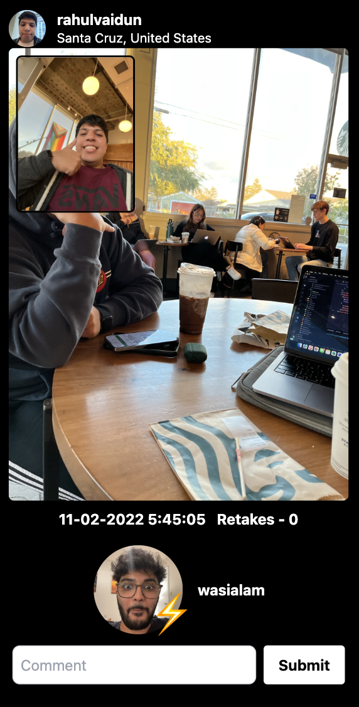
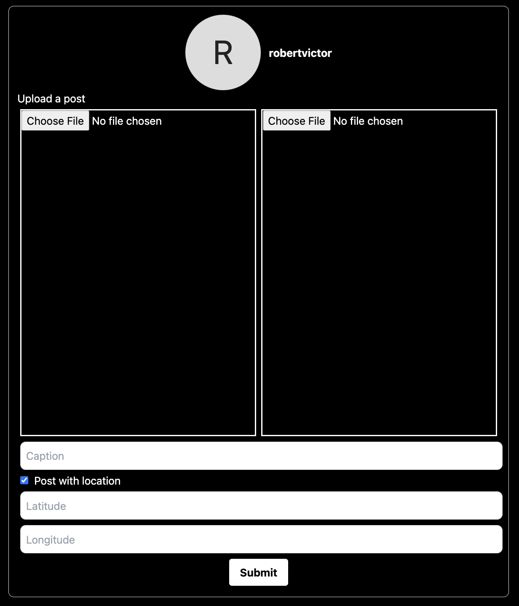

# BeFake

[https://befake.fr](https://befake.fr)

## Features

1. See friends' posts without posting anything yourself

   BeFake allows you to see your friends' posts without posting anything yourself. You can also screenshot their posts without them getting notified. You can also see the location (if available), date and time, retakes, comments, and realmoji reactions on all posts. You can even write your own comments straight from BeFake. Support for realmoji reactions is coming soon.

   <!-- add an image -->

   

2. Upload your own posts

   You can also upload your own posts with photos from your camera roll, which will be visible to your friends. GIFs are also supported, meaning your BeReal can be a GIF! The BeFake client also supports custom location with longitude and latitude.

   

## Development Setup

See [Vite Configuration Reference](https://vitejs.dev/config/).

## Project Setup

```sh
npm install
```

### Compile and Hot-Reload for Development

```sh
npm run dev
```

### Lint with [ESLint](https://eslint.org/)

```sh
npm run lint
```
